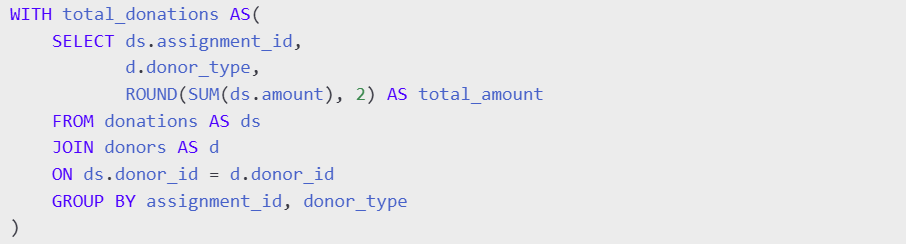
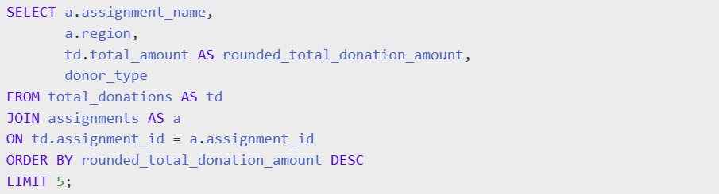
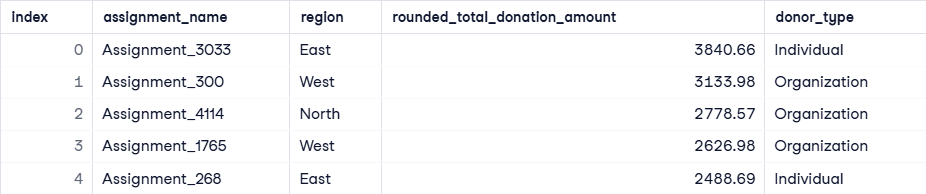
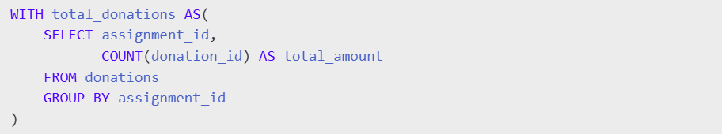
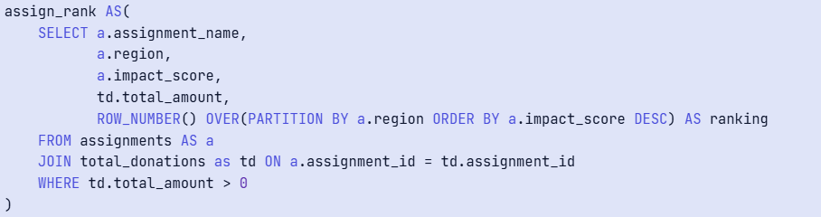
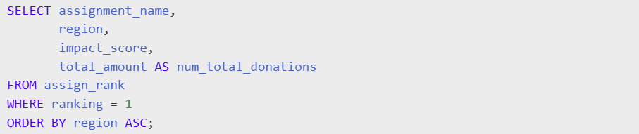
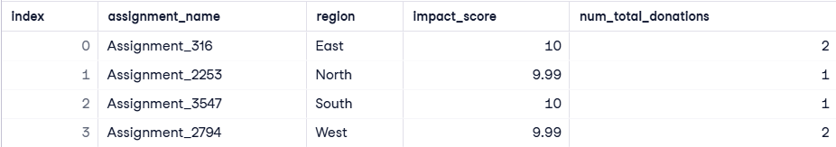

# GoodThought NGO Data Analysis
This project explores donation and impact data to derive meaningful insights, allowing for better resource allocation and strategy planning.

## Objectives
1. Identify the **top five assignments** based on **total value of donations**, categorized by donor type.
2. Determine the **highest-impact assignment in each region** that has **received at least one donation**.

## Dataset Description
The GoodThought database consists of three main tables:

#### Assignments:
- **assignment_id** - Unique identifier for each assignment.
- **assignment_name** - Name of the assignment.
- **region** - Geographical region of the assignment.
- **impact_score** - The measured impact of the assignment.

#### Donations:
- **donation_id** - Unique identifier for each donation.
- **assignment_id** - The assignment to which the donation was made.
- **amount** - The amount donated.
- **donor_id** - The donor who contributed.

#### Donors:
- **donor_id** - Unique identifier for each donor.
- **donor_type** - The type of donor (individual, corporate, government, etc.).

## Code Explanation
### 1. Identifying the Top 5 Assignments by Total Donations
To determine the five assignments with the highest total donation values, categorized by donor type, we use the following query:

### 1.1. Calculating Total Donations per Assignment by Donor Type
First, we calculate the total donation amount for each assignment, grouped by donor type:

This creates a temporary table (**total_donations**) where each assignment is mapped to its donor type and total donation amount.

### 1.2. Retrieving the Top 5 Assignments Based on Total Donations
Next, we retrieve assignment details and select the top five based on total donation amounts:

This ensures we get only the **top five assignments** with the **highest donation values**, sorted in descending order.

#### Output:
A table listing the top five assignments, their regions, total donation amounts (rounded), and donor types.

### 2. Identifying the Highest Impact Assignment per Region
To find the assignment with the highest impact score in each region (ensuring each has received at least one donation), we break the query into multiple steps:
### 2.1. Counting Total Donations per Assignment
First, we count the total number of donations received by each assignment:

This creates a temporary table (total_donations) where each assignment is mapped to its total number of donations.

### 2.2. Ranking Assignments by Impact Score within Each Region
Next, we assign a ranking to each assignment within its region, ordering them by impact score in descending order:

- Use PARTITION BY a.region to group assignments by region.
- Order assignments within each region by impact_score DESC.
- Assign a ROW_NUMBER() to rank the highest-impact assignments in each region.

### 2.3. Selecting the Top-Ranked Assignment per Region
Finally, we filter the highest-ranked assignment per region and sort the results:

This ensures that only the highest-impact assignment for each region is included in the final output.

#### Output:

## Results
- **Top Donations**: The highest-funded assignment (**Assignment_3033**) received significant contributions (**$3840.66**) from **individual donors**
- **Regional Impact**: The highest-impact assignments from each region were all relatively the **same**.

## Conclusion
This project provided a data-driven perspective on GoodThought NGO’s assignments, helping to understand where funding is concentrated and which assignments have the greatest impact. These insights can assist in improving fundraising strategies and optimizing resource allocation for future projects.

#### Technology Used
- Language: **SQL**
- Concepts: **Joins**, **Aggregation**, **Window Functions**, **Ranking**
